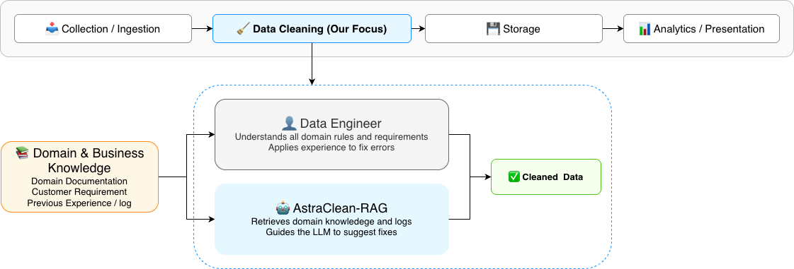
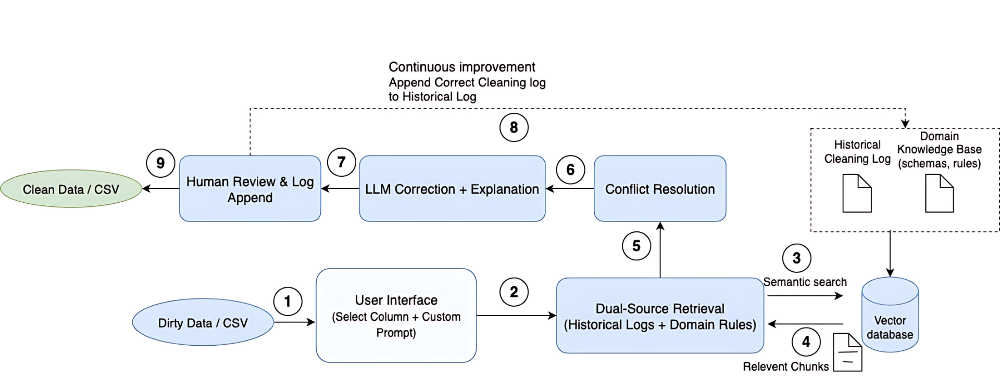

# AstraClean-RAG

**A Retrieval-Augmented Generation (RAG) framework for intelligent tabular data cleaning.**  
AstraClean-RAG combines large language models with dual-source retrieval to make data cleaning more reliable, explainable, and reusable.

- **Dual Sources of Evidence:**  
  (1) Historical correction logs capturing verified past fixes.  
  (2) Domain knowledge bases encoding valid rules, mappings, and formats.  

- **Key Features:**  
  ✓ Retrieval-grounded cleaning for consistency and transparency  
  ✓ Human-in-the-loop verification and feedback logging  
  ✓ Continuous improvement without retraining  

---

### System Overview

  
*High-level integration of AstraClean-RAG in the data engineering pipeline.*

  
*Dual-source retrieval and feedback workflow.*

  
*Interactive web demo for uploading data, cleaning, and validating results.*


## Repository Structure

```
.
├─ backend/     # FastAPI service: retrieval, cleaning pipeline, Qdrant integration
├─ frontend/    # React web app: upload, configure, run, review results
├─ testdata/    # Example CSVs and small KB/log JSONL samples
└─ system_image/      # Diagrams (e.g., high_level.drawio.png, dataclenaing.png)
```

---

## Quick Start

### 1) Backend

```
cd backend
python3.11 -m venv .venv && source .venv/bin/activate   # Windows: .venv\Scripts\activate
pip install -r requirements.txt
cp .env.example .env
```

Edit the file `backend/.env` and add:

```
QDRANT_URL=
QDRANT_API_KEY=
OPENAI_API_KEY=
OPENAI_MODEL=
```

Run the backend server:

```
uvicorn app.main:app --reload
```

---

### 2) Frontend

```
cd frontend
npm install
npm start
```
The application hosted locally will run on port **3000**:  
[http://localhost:3000/](http://localhost:3000/)
## Usage

1. Upload a CSV file.  
2. Select target column(s) to clean.  
3. (Optional) Add short instructions, e.g., “State codes must be two uppercase letters.”  
4. Choose sources: **Domain KB**, **Historical Log**, or both.  
5. Click **Clean**, review each fix with its evidence, and approve, edit, or reject.  
6. Export the cleaned data. Approved fixes are stored in the log for reuse.

---

## Acknowledgment

Parts of this project are adapted from RetClean.

