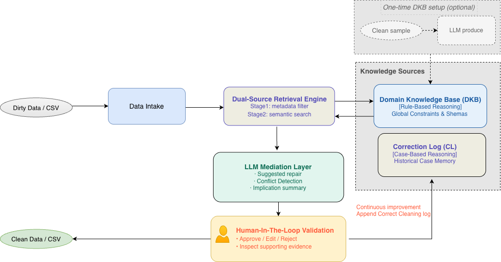
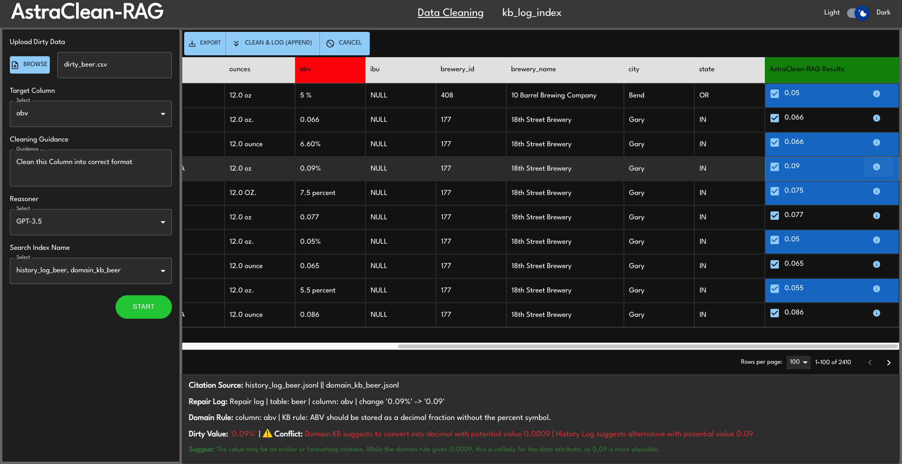
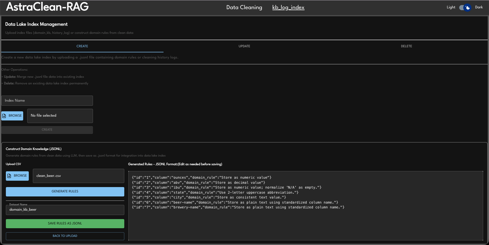
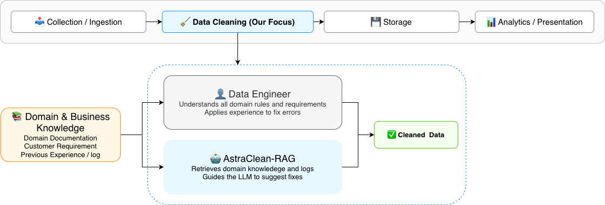

# AstraClean-RAG

**A Retrieval-Augmented Generation (RAG) framework for intelligent tabular data cleaning with LLM-powered conflict mediation.**  
AstraClean-RAG combines large language models with dual-source retrieval to make data cleaning more reliable, explainable, and reusable.

- **Dual Sources of Evidence:**  
  1. **Historical correction logs** capturing verified past fixes and corrections.  
  2. **Domain knowledge bases** encoding valid rules, mappings, formats, and constraints.  

- **Core Capabilities:**  
  ✓ Dual-source retrieval-augmented cleaning for consistency and transparency  
  ✓ LLM-based conflict mediation when sources disagree  
  ✓ Lightweight domain knowledge base (KB) construction from clean data  
  ✓ Human-in-the-loop verification and feedback logging  
  ✓ Continuous improvement through accumulated corrections  

---

---

## Version History

### v2.0
-  **LLM-based Conflict Mediation:** Intelligent analysis of disagreements between dual sources with reasoning 
-  **Domain KB Construction:** Generate domain rules directly from clean data samples 
-  **More evaluation dataset:** Added more datasets for evaluation
### v1.0
- Dual-source retrieval from domain KB and historical logs  
- Basic LLM-powered suggestion generation with confidence scores  
- Human-in-the-loop approval workflow  
- See [v1.0 release](https://github.com/bingxiangch/AstraClean-RAG/tree/v1.0)
---

### System Overview


  
*Dual-source retrieval, KB indexing, and LLM-based conflict mediation workflow (v2).*
  
*Interactive web UI for data upload, configuration, cleaning, and result review (v2).*

  
*Qdrant-based indexing strategy for domain KB and historical correction logs.*

  
*High-level integration of AstraClean-RAG in the data engineering pipeline.*
---

### System Architecture (v2)

Given a tabular dataset and lightweight cleaning instructions, the system identifies anomalous cells, retrieves evidence from both the Domain Knowledge Base (DKB) and the Correction Log (CL), and sends the retrieved evidence to an LLM-based mediation layer. The output is then presented to a human reviewer as either a suggested repair or a structured summary of conflicting evidence. Once the reviewer makes a final decision, the validated correction is appended to the CL for future reuse.  
---

### What's New in v2 (from v1)


#### 1. **LLM-Based Conflict Mediation**

The system retrieves evidence from both the domain knowledge base (DKB) and the history log (CL), and formats them into structured contexts.  
These contexts are then provided to the LLM together with a mediation instruction.

The LLM analyzes whether the two sources support the same repair:
- If they are aligned, it returns a unified repair suggestion.
- If they disagree, it generates a structured conflict summary for human review.

#### 2. **Automated Domain KB Construction**

Generate domain-specific rules directly from clean data samples without manual rule writing. Supports column-level rule generation with human review workflow.


---

## Quick Start

### 1) Backend

```
cd backend
python3.11 -m venv .venv && source .venv/bin/activate   # Windows: .venv\Scripts\activate
pip install -r requirements.txt
cp .env.example .env
```

Edit the file `backend/.env` and add:

```
QDRANT_URL=
QDRANT_API_KEY=
OPENAI_API_KEY=
OPENAI_MODEL=
```

Run the backend server:

```
uvicorn main:app --reload
```

---

### 2) Frontend

```
cd frontend
npm install
npm start
```
The application hosted locally will run on port **3000**:  
[http://localhost:3000/](http://localhost:3000/)

---


## Key Configuration

### Environment Variables (`.env`)

```bash
# Qdrant Vector DB
QDRANT_URL=http://localhost:6333
QDRANT_API_KEY=xxx

# LLM Providers
OPENAI_API_KEY=sk-xxx
OPENAI_MODEL=gpt-4

```


## Acknowledgment

Parts of this project are adapted from RetClean.


